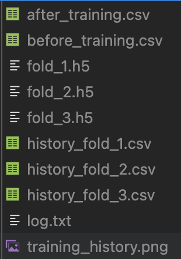

This document is to explain transfer learning process. The demo code is in `test/transfer_learning.py`.

Assume you are in the root directory `./tandem`, run the code by `python test/transfer_learning.py`.

# 1. Input file 

## 1.1. Features and labels of GJB2 SAVs

Example input: [data/GJB2/final_features.csv](../data/GJB2/final_features.csv).
The structure of this file is:

```python
SAV_coords  labels  feature_1   feature_2   ...
...
```
- `SAV_coords`: SAV coordinates (e.g., P29033 217 Y D)
- `labels`: 0 (benign) or 1 (pathogenic)
- `feature_i`: protein feature

## 1.2. DNN foundation model

Example: [../models/different_number_of_layers/20250423-1234-tandem/n_hidden-5/model_fold_1.h5](../models/different_number_of_layers/20250423-1234-tandem/n_hidden-5/model_fold_1.h5) or TANDEM_1.


We have such 5 foundation models, and I simply take the first one as a demo. This model was trained on R20000 set. 

**Model Configuration**
|   Layer   | Activation | Batch Norm | Dropout Rate |  Initializer   | L1 |   L2   | N Neurons |
|-----------|------------|------------|--------------|----------------|----|--------|-----------|
|   Input   |     -      |     -      |     0.0      |       -        | -  |   -    |     33    |
| hidden_00 |    gelu    |   False    |     0.0      | glorot_uniform | 0  | 0.0001 |     33    |
| hidden_01 |    gelu    |   False    |     0.0      | glorot_uniform | 0  | 0.0001 |     33    |
| hidden_02 |    gelu    |   False    |     0.0      | glorot_uniform | 0  | 0.0001 |     33    |
| hidden_03 |    gelu    |   False    |     0.0      | glorot_uniform | 0  | 0.0001 |     33    |
| hidden_04 |    gelu    |   False    |     0.0      | glorot_uniform | 0  | 0.0001 |     10    |
|   Output  |  softmax   |     -      |      -       |       -        | -  |   -    |     2     |

**Training Configuration**
|  Training | Batch Size | N Epochs |           Loss           |       Metrics       |
|-----------|------------|----------|--------------------------|---------------------|
|  Training |    300     |   300    | categorical_crossentropy | ['accuracy', 'AUC'] |

|  Training | lr         | algorithm|
|-----------|------------|----------|
| Optimizer |   5e-05    |  Nadam   |

Early stop: `patient` = 50, `start_from_epoch` = 50

# 2. Transfer learning

In my work, there were 4 steps in transfer learning protocol.
To simply explain our method, we just took the whole network of foundation model and re-trained it, so the number of parameters remains the same. 

## 2.1. Set up data, model, and hyper-parameters

- R20000 data: [data/R20000/final_features.csv](../data/R20000/final_features.csv)
- training data: [data/GJB2/final_features.csv](../data/GJB2/final_features.csv)
- model: [../models/different_number_of_layers/20250423-1234-tandem/n_hidden-5/model_fold_1.h5](../models/different_number_of_layers/20250423-1234-tandem/n_hidden-5/model_fold_1.h5)
- hyper-parameters: I used the same as above, only change `start_from_epoch = 10`

**Preprocessing data**

Input features were standardized and mean-imputed prior to training.

For example, a SAV with 33 features has a missing feature 1. We standardized and mean-imputed as follow:
- Calculate the mean and std of feature 1 from R20000 dataset
- Impute the mean to that missing feature
- Standardize the value based on mean and std

For this preprocessing job, I wrote a class name `Preprocessing` (`src.modules.Preprocessing`)

## 2.2. Train, val, and test splitting
I used cross-validation (CV) object `StratifiedKFold` from `sklearn` with 3-fold CV with 6:3:1 = train:val:test
In the input file, I have 47 GJB2 SAVs which is then divided into 28 train : 14 val : 5 test

## 2.3. Load foundation model and train :D

Training process is typical for every ML/AI model. I wrote a function to do this job as `train_model` (`src.train.train.train_model`)
- Load/initialize model
- Callback
- EarlyStopping
- Model compile
- Model fit 

Since I ran 3-fold CV (ei. 3 times), I obtained 3 models.

## 2.4. Model evaluation

This step is simple, using model.evaluate(). I compiled 5 metrics (accuracy, auc, precision, recall, f1_score), it outputs 6 values including the loss.

# 3. Output files

Here is the output list. We can change it later, I designed it to benefit my research.



- `after_training.csv` and `before_training.csv` are to save the average result of 3 transfer learning model `after` and `before`, evaluating on some sets (first row is mean, second row is sem). They are using to create the below as an example.
```bash
Before Training
-----------------------------------------------------------------
val_loss	0.40±0.02, val_accuracy	    85.71±0.00%, 
test_loss	0.35±0.00, test_accuracy	100.00±0.00%, 
-----------------------------------------------------------------
After Training
val_loss	0.33±0.04, val_accuracy	    85.71±0.00%, 
test_loss	0.19±0.06, test_accuracy	100.00±0.00%, 
-----------------------------------------------------------------
```
- `fold_i.h5`, i:1->3: transfer learning models
- `history_fold_i.csv`, i:1->3: history of train/val loss/accuracy 
- `log.txt`: just the log
- `training_history.png`: plotting of `history_fold_i.csv`

You may see some of untypical loss curves when doing this transfer learning. Be calm, we'll deal with it. 

# 4. Model inferencing

Stay tuned! I will document it later. The code for model inferencing is in [../src/predict/inference.py](../src/predict/inference.py).

Using it is something like this 
```python
mi = ModelInference(folder=models, r20000=r20000, featSet=list(self.featSet))
mi.calcPredictions(fm)
```